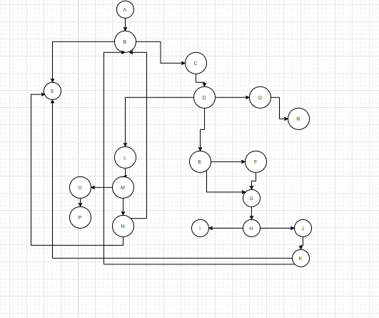

# Втора лабораториска вежба по Софтверско инженерство

## Бојан Владов, бр. на индекс 173004

### Група на код: 

Ја добив групата на код 6

###  Control Flow Graph

 

### Цикломатска комплексност
   Цикоматска комплекност = Број на Ребра - Број на Јазли +2
   
   М = Е - N + 2
   E=Број на ребра:23
   N=Број на јазли:19
   Цикоматската комплекност е 6
   

### Тест случаи според критериумот  Every statement 
        Со давање на вредност за аголот   80,40,20  ги изминав:A-B,B-C,C-D,D-E,E-G,G-H,H-J,J-K,k-B
        потоа зададов други вредности:365,0,0 и ги изминав:   D-l,Q-R
        следно зададов вредности:90,60,30   и ги изминав: E-F
        следно зададов вредности:180,50,60  и ги изминав:  H-I
        следно зададов вредности:360,0,0  и ги изминав: L-M,M-N,N-S
        следно зададов вредности:360,55,0  и ги изминав:   L-M,M-O,O-P
        
....

### Тест случаи според критериумот Every path

.... 

### Објаснување на напишаните unit tests

...
...